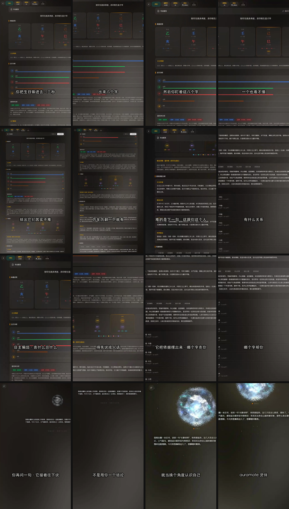

# auramate-video — 把「做视频」装进 agent

一组**可安装、可直接执行**的 skill。装上之后，一个**零 context 的 agent** 能自己
从选题写到交付包：写脚本、扒素材、录产品界面、配音、烧字幕、出封面、打包，
并且在每个关口自检。

不是理论。这是 2026-05 → 2026-08 做了 **60+ 条真实成片**（抖音竖版 / B 站横版 /
玄学混剪 / 产品演示）被反复打回、返工、验收之后沉淀下来的东西。
每一条硬规矩背后都对应一次被否掉的版本。

---

## Demo

<video src="https://cdn.jsdelivr.net/gh/ChenJiangxi/auramate-video@main/docs/demo/demo.mp4" controls width="300"></video>

**26.6s · 1080×1920 · 真配音 · 全程有声** —— 播放器出不来就
[直接看 mp4](https://cdn.jsdelivr.net/gh/ChenJiangxi/auramate-video@main/docs/demo/demo.mp4)。



<sub>每拍取「起 / 终」两帧，看得出镜头在推。另有 [12 秒无声 GIF 预览](docs/demo/demo.gif)——
**GIF 没有音轨**，要听配音看上面的播放器。</sub>

### 这条 demo 是怎么来的

选题从**用户的真实动作**切入，不是产品自述：

> 你把生日输进去，三秒，出来八个字。然后你盯着这八个字，一个也看不懂。
> —— 排出它们其实不难，万年历翻一下就有；难的是下一句：这跟你这个人有什么关系。

八拍逐句对应画面（`shots.tsv` 第 6 列就是这么写的）：整页 → 推到四柱八个字 →
拉回全貌 → 推向成段解读 → 日主五行区 → 沿依据下移 → 灵体追问 → 品牌收尾。

用这个 repo 的脚本从头跑：真配音（现调 MiniMax，`presenter_male` @1.28）、
**1080 原生录屏 + 真推镜**（起终缩放 1.4–1.8×）、字幕按每句配音实测时长算。

### 两个反直觉的结论（都是被打回后量出来的）

**一、录宽再推近，不要录窄将就。** 720 窄布局内容看着大，但升到 1080 已经 1.5×，
再推就糊 → 于是不敢推 → 全片只剩 1.06–1.12× 的位移，**观众一眼看出「这不是推镜，是平移」**。
换 1080 录制后可以放心推 1.7×，主体又大又锐。`motion.sh` 现在会算起终缩放比，
低于 1.25× 直接警告。

**二、合成前必须逐拍核对画面。** agent 看不见画面，按秒数猜框必然「说 A 显 B」。
`lib/preview-shots.sh` 在合成**之前**抽帧拼图 + 并排打印「台词 ↔ 画面」，
`shots.tsv` 第 6 列强制写清这拍要显什么。

---

### 别人要用，需要自己准备什么

把这个 repo 交给另一个人 / 另一个 agent，**除了 clone 之外还要补四样东西**。
前两样 `setup.sh` 会自动查并告诉你怎么补，后两样只能人来给。

**① 机器上的工具**（`./setup.sh` 尽量自动装）

`ffmpeg`（带 libx264）· `python3 + Pillow` · **中文字体** ·（按需）`node + playwright + chromium` · `yt-dlp`

> 中文字体是最容易被忽略的一条：Linux 上不装的话，字幕和封面会渲成**一堆方框**。
> 脚本会自动在 macOS / Linux / Windows 的常见路径里找，找不到会直接告诉你装哪个包
> （`fonts-noto-cjk` 之类），也可以用 `VIDEO_CJK_FONT` 或 `--font` 指定。

**② 凭据**（都走环境变量，repo 里只有占位符，见 `SECRETS-CHECKLIST.md`）

| 变量 | 干什么用 | 不给会怎样 |
|---|---|---|
| `MINIMAX_API_KEY` | 真配音 | 退回占位配音，全流程照跑 |
| `MINIMAX_API_BASE` | 国内区要改成 `api.minimaxi.com` | 用错区域报 `2049` |
| 克隆音 `voice_id` | 用「本人声音」旁白 | 用系统音色，不影响 |
| 产品站 URL + 测试账号密码 | 录自家界面 | 录不了产品画面，可以只用外部素材和卡 |

**③ 内容侧 —— 大部分素材 agent 自己就能拿到，不用人给**

| 素材 | 谁来搞 |
|---|---|
| **产品界面画面** | **agent 自己录**。给 URL + 测试账号就行（`lib/rec-page.js`，已在真实站点上验过：登录 → 录屏 → 720×1280 输出） |
| **外部真人切片 / 空镜** | **agent 自己扒**（`lib/fetch-clip.sh` 走 yt-dlp，含抽帧查水印） |
| 动效卡 / 数据榜 | agent 自己渲（`lib/storyboard.js` + 5 套模板） |
| 封面 | agent 自己出（`lib/make-cover.py`，背景从成片抽帧） |

**真正只能人给的，收敛成三样**：

- **品牌几个字段**：品牌名 / 网址 / 角标文案 / 主色。都是参数，说一次就行
  （`make-brand-assets.py --url --brand`、`make-cover.py --accent`、卡模板的 `accent`）。
- **真实数据**：榜单 / 测评类的数字必须是**真跑出来的实验结果**，抓取拿不到。
  这套 skill 的硬规矩之一就是**数字绝不编**，它不会替你造数——没有真数据就别做这类选题。
- **行业红线**：`skills/compliance-redlines/` 是按**中国内容平台 + 命理玄学题材**写的。
  换行业（医美 / 金融 / 教育…）红线完全不同，那份词表要重写。

**④ Codex 侧的启动参数**（见上一节，非交互跑必须关审批、按 CLI 版本选模型）

---

### ⚠ skill 给的是知识和脚本，不是能力

**把 skill 丢给一个空白 agent（codex / 别的 CLI），它不会自动就有录屏和配音。**
这些能力取决于**宿主机上有什么**、以及**能不能出网**：

| 能力 | 需要 | 没有会怎样 |
|---|---|---|
| 剪辑合成 / 竖版化 / 交付 | `ffmpeg` + `ffprobe`（带 libx264） | 全线不可用，这是底线 |
| 字幕 / 封面 / 图片补丁 | `python3` + `Pillow` | 出不了字幕和封面 |
| **占位配音**（跑通管线用） | `ffmpeg` | — |
| 真配音 | `node` + `MINIMAX_API_KEY` + 能出网到 `api.minimax.io` | 退回占位配音，管线照跑 |
| 产品录屏 | `node` + `playwright` + chromium + **目标站登录凭据** | 用不了自家界面画面 |
| HTML 卡渲染 | 同上（不需要凭据） | 出不了大字卡 / 数据榜 |
| 扒外部真实切片 | `yt-dlp` + 能出网到素材站 | 只能用手上已有的素材 |

```bash
./setup.sh            # 尽量自动装齐，最后按上表逐项报「行 / 不行 + 怎么补」
./setup.sh --check    # 只体检不安装
```

**只要「剪辑合成 + 字幕 + 占位配音」这三项在，就已经能跑通全流程出一版粗剪。**
录屏 / 真配音 / 扒素材是增量能力，缺哪个补哪个。

云沙箱型 agent（比如出网走白名单的）最容易卡在两处：chromium 装不下来（录屏和渲卡没了）、
`api.minimax.io` 不可达（配音没了）。`setup.sh` 会把这两条单独探测并明说。

---

## agent 装上之后会怎么干

```
① 选题   topic.md      钩子 + 为什么能火 + 落到什么功能 + 安全框
   ⤷ 闸门  check-compliance.py     ← 命理/玄学题材先过合规，不然全片白做
② 脚本   clips.json    一句 = 一个镜头 = 一段配音
   ⤷ 闸门  check-script.py         ← 单拍时长 / "ta" / 钩子具体性
③ 素材   footage/      真实切片 · 产品录屏 · 动效卡
④ 配音   audio/cNN.mp3 配音时长驱动后面所有时间轴
⑤ 合成   *-nosub.mp4   逐拍编码 → concat → 拼音轨 → mux
⑥ 字幕   *-v1.mp4      按配音时长算时间轴，1:1 不许漏行
⑦ 封面   cover.png     爆款风，不是学术风
⑧ 交付   交付包.zip     唯一文件名 + zip + 故事板图 + 文案
   ⤷ 闸门  audit-video.sh          ← 8 项机械检查 + 一张只有人能判的清单
```

**核心机制是音频驱动**：先配音，用 `ffprobe` 量出每句真实时长，视频每一拍 = 这句配音 + 0.25s。
反过来做（先定画面长度让配音去凑）必然出现「画面停在那儿死寂几秒」。

**闸门是前置的**，因为返工成本差着数量级：选题错要全片重做，参数错只要重跑一次脚本。

---

## 我要做 X → 读哪几个文件

| 我要… | 按顺序读 |
|---|---|
| **做一条抖音竖版片** | `skills/video-master/` → `skills/topic-and-script/` → `skills/vertical-shortform/` |
| **只是想先跑通看看** | 上面「卡模板长什么样」那段命令 → `references/zero-context-walkthrough.md` |
| **想选题 / 写口播稿** | `skills/topic-and-script/`（角度库 + 钩子句式 + 实测语速） |
| **确认这题材能不能做** | `skills/compliance-redlines/`（先过这关，再谈别的） |
| **扒外部真实素材** | `skills/real-clip-mashup/` → `lib/fetch-clip.sh` → `lib/fit-vertical.sh` |
| **录自家产品界面** | `skills/product-demo/` → `lib/rec-page.js` → `lib/motion.sh`（推拉）→ `lib/wrap-chrome.sh` |
| **做大字卡 / 数据榜** | `skills/html-motion-cards/` → `lib/storyboard.js` |
| **配音** | `skills/tts-voiceover/` → `lib/gen-voice.mjs` |
| **加字幕** | `skills/subtitles/` → `lib/gen-subs.py` + `lib/burn-subs.sh` |
| **出封面** | `skills/cover-thumbnail/` → `lib/make-cover.py` |
| **ffmpeg 参数记不清** | `skills/ffmpeg-cookbook/`（配方 + 报错速查） |
| **交付前自审** | `skills/quality-gate/` → `lib/audit-video.sh` |
| **打交付包** | `skills/delivery/` → `lib/package-delivery.sh` |
| **做 B 站横版长片** | `references/bilibili-longform.md` |
| **写平台文案** | `references/caption-template.md` |

---

## 目录

| 路径 | 是什么 |
|---|---|
| `skills/video-master/` | **总纲**。合规红线 + 硬规矩 + 选题路由 + 8 阶段管线 + 验收清单。**先读这个。** |
| `skills/compliance-redlines/` | **合规红线**。命理/玄学题材的违规边界、词表、安全表达框架。优先级最高 |
| `skills/topic-and-script/` | **选题与脚本**。决定 80% 的那一环：角度库、钩子句式、实测语速、文案模板 |
| `skills/vertical-shortform/` | 竖版短视频（抖音 / 小红书，1080×1920，40–60s）完整管线 |
| `skills/real-clip-mashup/` | 真人切片混剪：yt-dlp 扒真实素材 → 竖版化 → 混剪 |
| `skills/product-demo/` | 产品录屏演示：素材盘点 → 录屏 → 裁切放大 → 假浏览器壳 |
| `skills/html-motion-cards/` | HTML/CSS 动效卡：5 套模板 + 公共设计系统 + storyboard 驱动渲染 |
| `skills/tts-voiceover/` | 配音：MiniMax T2A v2、克隆音 / 系统音色、语速、读音坑 |
| `skills/subtitles/` | 字幕：PIL overlay（无 libass 环境）+ ASS 两条路 |
| `skills/cover-thumbnail/` | 封面：爆款风巨字 + 戏剧图 + 副标 |
| `skills/quality-gate/` | **交付前质量闸门**：一条命令跑完机械检查 + 17 条真实被打回案例 |
| `skills/delivery/` | 交付：唯一文件名 + zip + 故事板图 + faststart |
| `skills/ffmpeg-cookbook/` | ffmpeg 配方库：竖版化、zoompan、concat、mux、探测 |
| `lib/` | 可直接跑的脚本（扒素材 / 竖版化 / build / 配音 / 字幕 / 封面 / 合规 / 审计 / 交付） |
| `references/` | 长文参考：零 context 走查、B 站横版长视频、平台文案模板 |
| `examples/` | 两个可跑样例（`hello-vertical` 最小链路 / `demo-vertical` 卡模板预览），都不需要 API key |
| `tests/validate.sh` | 自检：一致性、frontmatter、死链、4 个 linter、端到端渲染、零 key 冒烟 |
| `tests/check-consistency.py` | 一致性：孤儿脚本 / 路由完整 / README 覆盖 / **旧说法不许复活** |
| `setup.sh` | 装依赖并按**能力**汇报（剪辑 / 字幕 / 配音 / 录屏 / 扒素材 各自行不行） |
| `install.sh` | 接到 agent 上：`claude`（.claude/skills）/ `codex`（AGENTS.md）/ `bundle`（单文件） |
| `templates/AGENTS.md.tpl` | 给 Codex 用的 AGENTS.md 模板（路由 + 硬规矩摘要 + 命令速查） |
| `SECRETS-CHECKLIST.md` | **需要人类通过 prompt 传入的密钥清单**（repo 内只有占位符，无真值） |

---

## 依赖

必须：`ffmpeg` + `ffprobe`、`python3` + `Pillow`
（macOS 用 `/usr/bin/python3`，系统 python 自带 Pillow）

按需：`node` ≥ 18 + `playwright`（录屏 / 渲卡）、`yt-dlp`（扒素材）、MiniMax API key（配音）

```bash
./tests/check-deps.sh     # 缺什么、缺了会卡在哪一步，一次说清
```

> 很多 Homebrew 的 ffmpeg **不带 libass**，`-vf subtitles=` 会直接报错。
> 这个 repo 的字幕默认走 PIL overlay 路线，不依赖 libass。

---

## 三条底层原则

1. **真实 > 精致。** 真人切片、真实产品录屏、真实数据，永远赢过自己画的动效卡。
   被打回最多的一类版本就是「全是 HTML 卡」。
2. **数据绝不编。** 测评分数、准确率、统计数字只用真跑出来的值。
   自己画图（渲染）可以，自己编数字绝不。
3. **交付前留人类审核点。** 配音够不够有情绪、创意对不对味，agent 判断不了。
   工作流的作用是让人类的判断执行得飞快，不是取代它。

还有一条优先级更高的前置条件：**合规**。
宣扬封建迷信必违规；讲 AI 算命、讲产品功能不违规。做命理题材前先读
`skills/compliance-redlines/`，并对每条片子跑 `lib/check-compliance.py`。

---

## 还没验证的部分（诚实留档）

- 克隆音（`voice_id` 私有）没测过，只测了三个系统音色。
- `lib/render-card.js`（单张卡渲染）没单独跑过；不过同一条链路的
  `lib/storyboard.js` 每次 `validate.sh` 都会真渲 5 张卡。

`lib/rec-page.js` 已在真实站点上验过：登录 → 录屏 → 输出 720×1280 / 15.2s 的产品界面
（密码只走环境变量注入，不进 argv 和日志）。

`lib/gen-voice.mjs` 已在真实 MiniMax 接口上跑通（国际区，`presenter_male` /
`female-tianmei` / `female-shaonv` 三个音色都出音），上面 demo 的配音就是这么生成的。
key 走环境变量，repo 里只有占位符 —— 见 `SECRETS-CHECKLIST.md`。

其余部分——竖版化、裁切放大、浏览器壳、卡模板、字幕、审计、交付——
都在真实素材上跑过并抽帧目视确认过。

---

## 贡献 / 演进

每条新踩的坑 → 写进对应 skill 的「失败症状 → 修法」表。
不要新开一个 `NOTES.md`，坑必须落在**会被读到的那个 skill 里**。

改完跑 `./tests/validate.sh`，全绿才能推。

### 换了 demo 视频之后

README 顶部的播放器走 jsDelivr（`cdn.jsdelivr.net/gh/...@main/...`），因为
**GitHub 自己不能内联播放仓库里的 mp4** —— `raw.githubusercontent` 对 mp4 返回
`application/octet-stream` + `nosniff`，浏览器拿不到流；jsDelivr 返回的是
`video/mp4`，所以能播。（`<video>` 标签本身不会被 GitHub 过滤，实测过；
被过滤的只有 `poster` 属性。）

jsDelivr 对 `@main` 有 12 小时缓存，换了视频要手动刷一下：

```bash
./docs/demo/purge-cdn.sh      # 推送之后跑一次，CDN 立刻拿新文件
```
