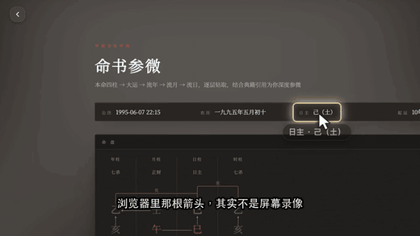

# auramate-video — 把「做视频」装进 agent

一组**可安装、可直接执行**的 skill。装上之后，一个**零 context 的 agent** 能自己
从选题写到交付包：写脚本、扒素材、录产品界面、配音、烧字幕、出封面、打包，
并且在每个关口自检。

不是理论。这是 2026-05 → 2026-08 做了 **60+ 条真实成片**（抖音竖版 / B 站横版 /
玄学混剪 / 产品演示）被反复打回、返工、验收之后沉淀下来的东西。
每一条硬规矩背后都对应一次被否掉的版本。

---

## Demo

<video src="https://cdn.jsdelivr.net/gh/ChenJiangxi/auramate-video@main/docs/demo/demo-16x9.mp4" controls width="640"></video>

**30.6s · 1920×1080 · 真配音 · 全程有声** —— 播放器出不来就
[直接看 mp4](https://cdn.jsdelivr.net/gh/ChenJiangxi/auramate-video@main/docs/demo/demo-16x9.mp4)。



### 这条 demo 是怎么来的

画面是**真站点的桌面录屏**（`auramate.net` 登录后的命盘页，1440×810 · dsf 2 →
每帧 2880×1620，正好 16:9，缩到 1920×1080 是降采样不是拉伸）。
配音是真的 MiniMax，字幕按配音时长算，七拍拼起来 30.6 秒。

**光标是画上去的** —— 截图和 `recordVideo` 都不含系统光标。视频里那根箭头移到
「日主 己（土）」上、最后真的点下去让页面动起来，都是 `--act` 动作表**按帧**驱动的。

**同一张动作表还负责指出该看哪**：给日主套个发光的框、给日柱那一列做暗场聚光、
在字底扫一条记号笔、旁边贴一句「日柱 · 己巳」。旁白说到哪个字段，画面就把哪个字段挑出来 ——
一屏几十个字段，这一层不做，观众得自己找，找的那两秒话已经过去了。

**镜头克制。** 上一版竖版 demo 推到 2.4×，一个字占了半屏，被打回过。
这条最大 1.4×，七拍里四拍完全不动 —— 该看哪由强调层说，不靠把画面怼到脸上。
运动只用来带路：`locate`（停→移→停）跟着光标走到日主，收尾 `pull-out` 拉回全景。

竖版那条 demo 还在：
[1080×1920 · 27.7s](https://cdn.jsdelivr.net/gh/ChenJiangxi/auramate-video@main/docs/demo/demo.mp4)（含转场与逐拍分镜图 `docs/demo/storyboard.png`）。
它演示的是另一件事 —— **文案先写逻辑链，再填字**。八句话各说一件事、彼此不搭，就是流水账：

```
① 现象  输生日 → 秒出八个字
② 但是  我看不懂                ← 「可」
③ 后来  排出它们根本不难          ← 「后来才知道」
④ 支撑  万年历上就有，谁排都一样
⑤ 论点  真正难的是讲成人话        ← 直接呼应③④的「不难」
⑥ 举例  日主偏弱、喜火忌水        ← 「比如」
⑦ 具体  哪个字克我、哪个字帮我 + 能追问
⑧ 落点  我想让它讲明白点
```

镜头跟着链走：推近到八个字 → 拉回全页（「谁排都一样」，拉开＝淡化这步）→ 转到解读正文。
推-拉-推有来有回，不是八拍一个套路（`lib/check-motion.py` 卡这个）。
**但它也是「推过头」的反面教材** —— 见下面第十条。

### 十个反直觉的结论（都是被打回、或者被量出来推翻的）

**一、布局归布局，像素归像素。** 想要高分辨率就把 viewport 调宽？
网站的响应式断点会切到桌面布局，主视觉缩到角落、大片留白，竖版素材直接报废。
正确做法：窄 viewport 保住移动端布局，`deviceScaleFactor` 拿像素，逐帧截图
（`recordVideo` 不认 dsf）。见 `lib/rec-frames.js`。
反过来也成立：**录 16:9 要加 `--desktop`**，不加会强制移动端仿真，网站切成手机布局；
而且视口本身就得是 16:9（1440×810，不是 1440×900），否则缩到 1920×1080 是横向拉伸。

**二、匀速插值不是推镜。** 从头到尾线性走，观众看到的是「画面在滑」。
镜头感来自**停顿**：停一下 → 移过去 → 定住（`--move locate`）。
起终缩放低于 1.25× 一律当没推，`motion.sh` 会直接警告。
但这不等于每拍都要推 —— 见第十条。

**三、技术全绿的稿子照样是讲解员腔。** 有一版八句里没有一个「我」、
没有一个语气词，等于没人站在这段话背后。`lib/check-humanness.py` 查这个。

**四、逻辑链是写字之前的事。** 三道 linter 全绿也可能是流水账——
机器查不了「这句接不接得住上一句」。见 `skills/topic-and-script/` §5.5。

**五、音画会逐拍漂移，而且不报错。** 每拍单独编码时 `-t` 会把时长向上取整到整帧，
一拍多十几毫秒，concat 起来**逐拍累加**。量了一条真实的 8 拍片子：
最后一拍画面比它的配音**晚 171ms**，一路越来越晚。
修法是先算每拍的**绝对**边界再取整到帧，误差就不累积了（实测降到 17ms，半帧以内）。
这条是做转场时才发现的 —— 转场必须把边界钉在绝对时间上，一钉就露馅了。

**六、加转场最容易犯的错是悄悄改了音画关系。** 交叉溶解要两段素材重叠，
重叠多少总长就短多少。正确做法是把转场塞进**上一拍句末的停顿里**、
让它结束在下一句开口的那一刻：总长不变，每句开口那一帧和硬切版一模一样，
音频也不用做交叉淡化。推导见 `skills/ffmpeg-cookbook/`「转场」。

**七、录屏里没有光标，也没人指路。** 截图和 `recordVideo` 都不含系统光标。不自己画一个，
出来就是页面自己在动、输入框自己在填字，读起来像 bug 演示。
但光标只说明「有人在操作」，不说明「该看哪」—— 一屏几十个元素，旁白正在说的那一个，
观众得自己找。所以动作表里还有 `spot`（暗场聚光）/ `ring`（高亮框）/ `mark`（记号笔）/
`label`（标注气泡），且**每帧重新量目标位置**，页面滚了框跟着走。
两者的动画都必须**按帧**推进 —— 逐帧截图的墙上间隔不均匀（一帧 100–300ms 还会抖），
用 CSS 动画的话水波纹在成片里会忽快忽慢。见 `lib/rec-frames.js --cursor --act`。

**八、想让录屏里的字更大，调视口，别裁**（竖版的情况）。 输出和源都是 9:16，
裁框必然是竖长条 —— 想框住一整行宽的东西，框就得跟画面一样宽，等于没裁；
真去裁，一段正文左右两头的字直接被切掉，比小一点更难读。
把视口从 720 调到 440，浏览器按更窄的宽度**重新排版**，同一段字占画幅的比例大 1.6 倍，
CSS 字号一个像素没变。**裁切是取景手段，不是放大手段。**

**九、镜头单一只有摊开全片才看得见。** 每一拍单看都合理，八拍连起来是一个套路。
量了一版：8 拍里 6 拍从全屏起手、7 拍横向零位移 —— 观众的说法是「永远是固定的路线」。
`lib/check-motion.py` 把全片摊平，卡起手位置、方向分布、推拉配比、有没有拍其实没动。

**十、放大也会过头，而且是双重的。** 第八条说「字小就调视口」，第二条说「推就要推够」，
两条一起用过头了：竖版 demo 的源是 440 窄视口（浏览器已经把字排大了），后期又推到 2.4×，
结果一个「酉」字占了半屏 —— 反馈原话是「打开显得视频里的字好大，不用放大成这样吧」。
**这两条不能叠着吃**：视口已经调窄过的素材，后期推镜就要收着；
16:9 的正常视口素材才有推的余地。而且**不是每拍都要推** ——
现在这条 16:9 demo 最大 1.4×、七拍里四拍完全不动，
该看哪交给强调层（`spot` / `ring` / `mark` / `label`），不靠把画面怼到脸上。

---

### 别人要用，需要自己准备什么

把这个 repo 交给另一个人 / 另一个 agent，**除了 clone 之外还要补四样东西**。
前两样 `setup.sh` 会自动查并告诉你怎么补，后两样只能人来给。

**① 机器上的工具**（`./setup.sh` 尽量自动装）

`ffmpeg`（带 libx264）· `python3 + Pillow` · **中文字体** ·（按需）`node + playwright + chromium` · `yt-dlp`

> 中文字体是最容易被忽略的一条：Linux 上不装的话，字幕和封面会渲成**一堆方框**。
> 脚本会自动在 macOS / Linux / Windows 的常见路径里找，找不到会直接告诉你装哪个包
> （`fonts-noto-cjk` 之类），也可以用 `VIDEO_CJK_FONT` 或 `--font` 指定。

**② 凭据**（都走环境变量，repo 里只有占位符，见 `SECRETS-CHECKLIST.md`）

| 变量 | 干什么用 | 不给会怎样 |
|---|---|---|
| `MINIMAX_API_KEY` | 真配音 | 退回占位配音，全流程照跑 |
| `MINIMAX_API_BASE` | 国内区要改成 `api.minimaxi.com` | 用错区域报 `2049` |
| 克隆音 `voice_id` | 用「本人声音」旁白 | 用系统音色，不影响 |
| 产品站 URL + 测试账号密码 | 录自家界面 | 录不了产品画面，可以只用外部素材和卡 |

**③ 内容侧 —— 大部分素材 agent 自己就能拿到，不用人给**

| 素材 | 谁来搞 |
|---|---|
| **产品界面画面** | **agent 自己录**。给 URL + 测试账号就行（`lib/rec-page.js`，已在真实站点上验过：登录 → 录屏 → 720×1280 输出）。要光标 / 强调 / 16:9 就换 `lib/rec-frames.js`（横版加 `--desktop --w 1440 --h 810`） |
| **外部真人切片 / 空镜** | **agent 自己扒**（`lib/fetch-clip.sh` 走 yt-dlp，含抽帧查水印） |
| 动效卡 / 数据榜 | agent 自己渲（`lib/storyboard.js` + 5 套模板） |
| 封面 | agent 自己出（`lib/make-cover.py`，背景从成片抽帧） |

**真正只能人给的，收敛成三样**：

- **品牌几个字段**：品牌名 / 网址 / 角标文案 / 主色。都是参数，说一次就行
  （`make-brand-assets.py --url --brand`、`make-cover.py --accent`、卡模板的 `accent`）。
- **真实数据**：榜单 / 测评类的数字必须是**真跑出来的实验结果**，抓取拿不到。
  这套 skill 的硬规矩之一就是**数字绝不编**，它不会替你造数——没有真数据就别做这类选题。
- **行业红线**：`skills/compliance-redlines/` 是按**中国内容平台 + 命理玄学题材**写的。
  换行业（医美 / 金融 / 教育…）红线完全不同，那份词表要重写。

**④ Codex 侧的启动参数**（见上一节，非交互跑必须关审批、按 CLI 版本选模型）

---

### ⚠ skill 给的是知识和脚本，不是能力

**把 skill 丢给一个空白 agent（codex / 别的 CLI），它不会自动就有录屏和配音。**
这些能力取决于**宿主机上有什么**、以及**能不能出网**：

| 能力 | 需要 | 没有会怎样 |
|---|---|---|
| 剪辑合成 / 竖版化 / 交付 | `ffmpeg` + `ffprobe`（带 libx264） | 全线不可用，这是底线 |
| 字幕 / 封面 / 图片补丁 | `python3` + `Pillow` | 出不了字幕和封面 |
| **占位配音**（跑通管线用） | `ffmpeg` | — |
| 真配音 | `node` + `MINIMAX_API_KEY` + 能出网到 `api.minimax.io` | 退回占位配音，管线照跑 |
| 产品录屏 | `node` + `playwright` + chromium + **目标站登录凭据** | 用不了自家界面画面 |
| HTML 卡渲染 | 同上（不需要凭据） | 出不了大字卡 / 数据榜 |
| 扒外部真实切片 | `yt-dlp` + 能出网到素材站 | 只能用手上已有的素材 |

```bash
./setup.sh            # 尽量自动装齐，最后按上表逐项报「行 / 不行 + 怎么补」
./setup.sh --check    # 只体检不安装
```

**只要「剪辑合成 + 字幕 + 占位配音」这三项在，就已经能跑通全流程出一版粗剪。**
录屏 / 真配音 / 扒素材是增量能力，缺哪个补哪个。

云沙箱型 agent（比如出网走白名单的）最容易卡在两处：chromium 装不下来（录屏和渲卡没了）、
`api.minimax.io` 不可达（配音没了）。`setup.sh` 会把这两条单独探测并明说。

---

## agent 装上之后会怎么干

```
① 选题   topic.md      钩子 + 为什么能火 + 落到什么功能 + 安全框
   ⤷ 闸门  check-compliance.py     ← 命理/玄学题材先过合规，不然全片白做
② 脚本   clips.json    一句 = 一个镜头 = 一段配音
   ⤷ 闸门  check-script.py         ← 单拍时长 / "ta" / 钩子具体性
③ 素材   footage/      真实切片 · 产品录屏 · 动效卡
④ 配音   audio/cNN.mp3 配音时长驱动后面所有时间轴
⑤ 合成   *-nosub.mp4   逐拍编码 → 拼接（转场落在句末停顿里）→ 拼音轨 → mux
⑥ 字幕   *-v1.mp4      按配音时长算时间轴，1:1 不许漏行
⑦ 封面   cover.png     爆款风，不是学术风
⑧ 交付   交付包.zip     唯一文件名 + zip + 故事板图 + 文案
   ⤷ 闸门  audit-video.sh          ← 8 项机械检查 + 一张只有人能判的清单
```

**核心机制是音频驱动**：先配音，用 `ffprobe` 量出每句真实时长，视频每一拍 = 这句配音 + 0.25s。
反过来做（先定画面长度让配音去凑）必然出现「画面停在那儿死寂几秒」。

拍长还要**按绝对边界取整到帧**。逐拍向上取整会累加，量过一条真片子：末拍画面比配音晚 171ms。

**闸门是前置的**，因为返工成本差着数量级：选题错要全片重做，参数错只要重跑一次脚本。

---

## 我要做 X → 读哪几个文件

| 我要… | 按顺序读 |
|---|---|
| **做一条抖音竖版片** | `skills/video-master/` → `skills/topic-and-script/` → `skills/vertical-shortform/` |
| **只是想先跑通看看** | 上面「卡模板长什么样」那段命令 → `references/zero-context-walkthrough.md` |
| **想选题 / 写口播稿** | `skills/topic-and-script/`（角度库 + 钩子句式 + 实测语速 + 人味儿关） |
| **确认这题材能不能做** | `skills/compliance-redlines/`（先过这关，再谈别的） |
| **扒外部真实素材** | `skills/real-clip-mashup/` → `lib/fetch-clip.sh` → `lib/fit-vertical.sh` |
| **录自家产品界面** | `skills/product-demo/` → `lib/rec-frames.js`（高像素 + 光标 + 动作表 + 强调；16:9 加 `--desktop`）→ `lib/check-rhythm.py`（**录完先量节奏**）→ `lib/motion.sh`（推拉）→ `lib/wrap-chrome.sh` |
| **做大字卡 / 数据榜** | `skills/html-motion-cards/` → `lib/storyboard.js` |
| **配音** | `skills/tts-voiceover/` → `lib/gen-voice.mjs` |
| **加字幕** | `skills/subtitles/` → `lib/gen-subs.py` + `lib/burn-subs.sh` |
| **加大字标注**（抖音那种红字） | `references/douyin-case-formsight.md` → `lib/gen-callouts.py` → `burn-subs.sh --manifest 字幕 --manifest 标注` |
| **出封面** | `skills/cover-thumbnail/` → `lib/make-cover.py` |
| **ffmpeg 参数记不清** | `skills/ffmpeg-cookbook/`（配方 + 报错速查） |
| **交付前自审** | `skills/quality-gate/` → `lib/audit-video.sh` |
| **打交付包** | `skills/delivery/` → `lib/package-delivery.sh` |
| **做 B 站横版长片** | `references/bilibili-longform.md` |
| **写平台文案** | `references/caption-template.md` |

---

## 目录

| 路径 | 是什么 |
|---|---|
| `skills/video-master/` | **总纲**。合规红线 + 硬规矩 + 选题路由 + 8 阶段管线 + 验收清单。**先读这个。** |
| `skills/compliance-redlines/` | **合规红线**。命理/玄学题材的违规边界、词表、安全表达框架。优先级最高 |
| `skills/topic-and-script/` | **选题与脚本**。决定 80% 的那一环：角度库、钩子句式、实测语速、文案模板 |
| `skills/vertical-shortform/` | 竖版短视频（抖音 / 小红书，1080×1920，40–60s）完整管线 |
| `skills/real-clip-mashup/` | 真人切片混剪：yt-dlp 扒真实素材 → 竖版化 → 混剪 |
| `skills/product-demo/` | 产品录屏演示：素材盘点 → 录屏（含可见光标 + 动作表 + 强调层）→ 裁切放大 → 假浏览器壳 |
| `skills/html-motion-cards/` | HTML/CSS 动效卡：5 套模板 + 公共设计系统 + storyboard 驱动渲染 |
| `skills/tts-voiceover/` | 配音：MiniMax T2A v2、克隆音 / 系统音色、语速、读音坑 |
| `skills/subtitles/` | 字幕：PIL overlay（无 libass 环境）+ ASS 两条路 |
| `skills/cover-thumbnail/` | 封面：爆款风巨字 + 戏剧图 + 副标 |
| `skills/quality-gate/` | **交付前质量闸门**：一条命令跑完机械检查 + 17 条真实被打回案例 |
| `skills/delivery/` | 交付：唯一文件名 + zip + 故事板图 + faststart |
| `skills/ffmpeg-cookbook/` | ffmpeg 配方库：竖版化、zoompan、concat、**转场（不动时间轴的推导）**、mux、探测 |
| `lib/` | 可直接跑的脚本（扒素材 / 竖版化 / build / 配音 / 字幕 / 封面 / 合规 / 审计 / 交付） |
| `references/` | 长文参考：零 context 走查、B 站横版长视频、平台文案模板、**同赛道爆款拆解** |
| `examples/` | 两个可跑样例（`hello-vertical` 最小链路 / `demo-vertical` 卡模板预览），都不需要 API key |
| `tests/validate.sh` | 自检：一致性、frontmatter、死链、4 个 linter、转场时间轴、光标与动作表、强调层、端到端渲染、零 key 冒烟 |
| `tests/check-consistency.py` | 一致性：孤儿脚本 / 路由完整 / README 覆盖 / **旧说法不许复活** |
| `setup.sh` | 装依赖并按**能力**汇报（剪辑 / 字幕 / 配音 / 录屏 / 扒素材 各自行不行） |
| `install.sh` | 接到 agent 上：`claude`（.claude/skills）/ `codex`（AGENTS.md）/ `bundle`（单文件） |
| `templates/AGENTS.md.tpl` | 给 Codex 用的 AGENTS.md 模板（路由 + 硬规矩摘要 + 命令速查） |
| `SECRETS-CHECKLIST.md` | **需要人类通过 prompt 传入的密钥清单**（repo 内只有占位符，无真值） |

---

## 依赖

必须：`ffmpeg` + `ffprobe`、`python3` + `Pillow`
（macOS 用 `/usr/bin/python3`，系统 python 自带 Pillow）

按需：`node` ≥ 18 + `playwright`（录屏 / 渲卡）、`yt-dlp`（扒素材）、MiniMax API key（配音）

```bash
./tests/check-deps.sh     # 缺什么、缺了会卡在哪一步，一次说清
```

> 很多 Homebrew 的 ffmpeg **不带 libass**，`-vf subtitles=` 会直接报错。
> 这个 repo 的字幕默认走 PIL overlay 路线，不依赖 libass。

---

## 三条底层原则

1. **真实 > 精致。** 真人切片、真实产品录屏、真实数据，永远赢过自己画的动效卡。
   被打回最多的一类版本就是「全是 HTML 卡」。
2. **数据绝不编。** 测评分数、准确率、统计数字只用真跑出来的值。
   自己画图（渲染）可以，自己编数字绝不。
3. **交付前留人类审核点。** 配音够不够有情绪、创意对不对味，agent 判断不了。
   工作流的作用是让人类的判断执行得飞快，不是取代它。

还有一条优先级更高的前置条件：**合规**。
宣扬封建迷信必违规；讲 AI 算命、讲产品功能不违规。做命理题材前先读
`skills/compliance-redlines/`，并对每条片子跑 `lib/check-compliance.py`。

---

## 还没验证的部分（诚实留档）

**只剩一条：克隆音（`voice_id` 私有）没测过**，只实测了三个系统音色的语速。
拿到能用的 `voice_id` 之后，量完把值回填进 `skills/topic-and-script/` 的语速表。

已经在真实条件下验过的：

| 这件事 | 怎么验的 |
|---|---|
| 真配音 | `lib/gen-voice.mjs` 打真 MiniMax 接口（国际区），`presenter_male` / `female-tianmei` / `female-shaonv` 都出音，README 上那条 demo 的配音就是它生成的 |
| 产品录屏 | `lib/rec-page.js` 和 `lib/rec-frames.js` 都登过真站点录过真界面；密码只走环境变量，不进 argv 和日志 |
| 光标 + 动作表 | 在真站点上真的移过去、点下去：竖版点大运/流年命盘多出一列，横版把箭头移到「日主 己（土）」再点快捷问题 —— 都是 demo 里那几拍 |
| 强调层 | 四种形态都在真站点录过（`tests/highlight-test.js` 20 条断言另外守着）：暗场聚光只留一块亮、高亮框不污染别处、记号笔不糊字、气泡贴着元素，且页面滚了框跟着走 |
| 横版 16:9 录制 | `--desktop` 在真站点录过 1440×810 · dsf 2（→ 2880×1620，缩到 1920×1080 是降采样），README 顶部那条 demo 就是它 |
| 单张卡渲染 | `lib/render-card.js` webm / `--png` 两种模式都进了 `validate.sh` 常驻断言 |
| 零 context 跑通 | 干净 `git clone` + 零 API key，从建工程走到 `AUDIT PASS`，已固化成常驻断言 |
| 其余 | 竖版化、裁切放大、镜头运动、转场、浏览器壳、卡模板、字幕、审计、交付 —— 都在真实素材上跑过并抽帧目视确认 |

key 走环境变量，repo 里只有占位符 —— 见 `SECRETS-CHECKLIST.md`。

---

## 贡献 / 演进

每条新踩的坑 → 写进对应 skill 的「失败症状 → 修法」表。
不要新开一个 `NOTES.md`，坑必须落在**会被读到的那个 skill 里**。

改完跑 `./tests/validate.sh`，全绿才能推。

### 换了 demo 视频之后

README 顶部的播放器走 jsDelivr（`cdn.jsdelivr.net/gh/...@main/...`），因为
**GitHub 自己不能内联播放仓库里的 mp4** —— `raw.githubusercontent` 对 mp4 返回
`application/octet-stream` + `nosniff`，浏览器拿不到流；jsDelivr 返回的是
`video/mp4`，所以能播。（`<video>` 标签本身不会被 GitHub 过滤，实测过；
被过滤的只有 `poster` 属性。）

jsDelivr 对 `@main` 有 12 小时缓存，换了视频要手动刷一下：

```bash
./docs/demo/purge-cdn.sh      # 推送之后跑一次，CDN 立刻拿新文件
```
