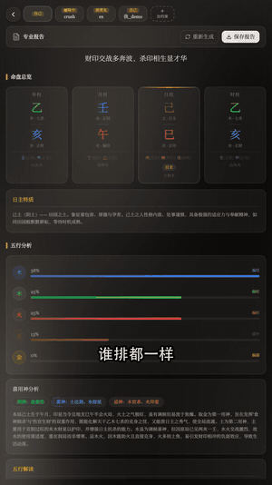
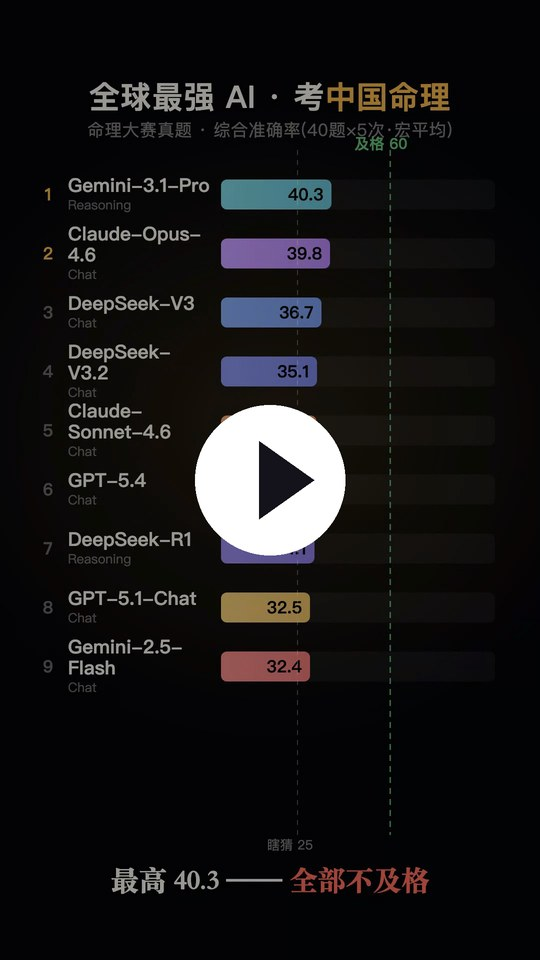

# auramate-video — 把「做视频」装进 agent

一组**可安装、可直接执行**的 skill。装上之后，一个**零 context 的 agent** 能自己
从选题写到交付包：写脚本、扒素材、录产品界面、配音、烧字幕、出封面、打包，
并且在每个关口自检。

不是理论。这是 2026-05 → 2026-08 做了 **60+ 条真实成片**（抖音竖版 / B 站横版 /
玄学混剪 / 产品演示）被反复打回、返工、验收之后沉淀下来的东西。
每一条硬规矩背后都对应一次被否掉的版本。

---

## Demo

<p align="center">
  
</p>

<p align="center">
  <a href="docs/demo/demo.mp4"></a><br>
  <b><a href="docs/demo/demo.mp4">▶ 点这里看完整版（55s · 1080×1920 · 带配音）</a></b>
</p>

> 上面的 GIF 是 6 个关键镜头各截 2 秒拼的精编，**没有声音**——
> GitHub 的 README 不能内联播放仓库里的 mp4
> （`raw.githubusercontent` 对 mp4 返回 `application/octet-stream` + `nosniff`，
> `<video>` 标签取不到流）。带配音的完整版点上面那个封面。
>
> 想要 README 里直接出播放器：把 `docs/demo/demo.mp4` 拖进本仓库的任意
> issue 评论框，GitHub 会生成一个 `user-attachments` 链接，把那个链接贴进 README
> 就会渲染成带声音的播放器。这一步需要网页端操作。


这条不是拿模板凑的演示片，是**照着一条真实交付过的选题（「AI 考中国命理」）
用这个 repo 的脚本从头跑出来的**——配音是这次**现调 MiniMax 接口**生成的
（`presenter_male` @1.28，9 句 52.7s），产品录屏和榜单数据都是真的，
字幕按每句配音的实测时长算。

```bash
# 配音这步长这样（key 从环境变量读，绝不进 argv）
MINIMAX_API_KEY=<你的key> node lib/gen-voice.mjs \
    --clips clips.json --out audio/ --voice presenter_male --speed 1.28
```

镜头构成（`shots.tsv` 九行，就是这么写的）：

| 拍 | 类型 | 画面 |
|---|---|---|
| c01 | 外部录屏切片 | 大模型排八字的真实输出 |
| c02–c04 | 数据卡 | 命理大赛真题实测榜（**真跑的分数**，不是编的） |
| c05 | 产品录屏 + 补丁 | 命盘页，地址栏 PIL 打补丁盖成 `auramate.net`，套浏览器壳 |
| c06 | 产品录屏 | 专业报告（日主 / 五行 / 喜用神） |
| c07–c08 | 产品录屏 | AWAKE 态灵体 + 功能页 |
| c09 | 产品录屏 | 灵体流式对话收尾 |

> **卡片只占 3 拍，其余全是真实画面**——这是这个 repo 的硬规矩之一：
> 卡只能当标题 / 数据展示，**不许整片都是卡**（`skills/video-master/` H1）。

### 顺手发现了原片的一个 bug

用 repo 的脚本重跑这条选题时，`build-vertical.sh` 直接报警：

```
⚠ c02 实际 6.37s ≠ 目标 10.29s（素材可能比这拍短）
⚠ c03 实际 6.37s ≠ 目标 7.80s（素材可能比这拍短）
```

榜单卡只渲了 6.36s，而这两拍分别需要 10.29s 和 7.80s。视频轨因此比音频轨短，
`-shortest` 把音频尾巴截掉了——**已交付的那一版成片 48.10s，而 9 段配音总长 52.31s，
有 4.2 秒配音没进片子**（收尾那句品牌词被砍掉大半）。

把榜单卡冻末帧延长到 12s 之后重建，成片 54.57s，音视频都完整。
这类问题肉眼很难发现，但机器一量就出来——这就是 `audit-video.sh` 存在的意义。

### 卡模板长什么样

`examples/demo-vertical/` 是另一条**纯模板**的预览片（5 套卡各一拍），
不需要任何素材和 API key，用来看模板系统：

```bash
./lib/make-placeholders.sh examples/demo-vertical
node lib/storyboard.js  --project examples/demo-vertical
./lib/build-vertical.sh --project examples/demo-vertical --out examples/demo-vertical/demo-nosub.mp4
/usr/bin/python3 lib/gen-subs.py --project examples/demo-vertical --skip c03 --no-merge
./lib/burn-subs.sh examples/demo-vertical/demo-nosub.mp4 examples/demo-vertical/demo-v1.mp4 \
                   --manifest examples/demo-vertical/subs/manifest.tsv
```

它的审计结果会明确写着「卡片占 100% —— 换真实素材」。**审计对自己人也不留情。**

---

## 给 agent 装上

### 方式一：把这段发给你的 agent

```
把 https://github.com/ChenJiangxi/auramate-video 克隆到本地，
把 skills/ 下所有目录复制到你的 .claude/skills/（或执行 ./install.sh <你的 agent 目录>），
然后读 skills/video-master/SKILL.md —— 它是总纲，会把你路由到该用的子 skill。

我要做的是：<在这里写需求，例如「一条 50 秒的抖音竖版片，讲 XXX」>

规矩照 skills/video-master/ 里写的来。开工前先跑 ./tests/check-deps.sh 看依赖；
没有 API key 就先用 lib/make-placeholders.sh 跑一版占位的给我看节奏。
交付前必须跑 lib/audit-video.sh，并把「只有人能判的」那张清单原样发给我。
```

### 方式二：命令行

```bash
git clone https://github.com/ChenJiangxi/auramate-video.git && cd auramate-video
./install.sh ~/your-agent-dir     # 复制 skills/* 到 <agent>/.claude/skills/
./tests/check-deps.sh             # 缺什么、缺了会卡在哪一步，一次说清
```

不装也行——**直接把 `skills/video-master/SKILL.md` 全文贴进 context 就能开工**，
它内部所有引用都是 repo 内相对路径。

---

## agent 装上之后会怎么干

```
① 选题   topic.md      钩子 + 为什么能火 + 落到什么功能 + 安全框
   ⤷ 闸门  check-compliance.py     ← 命理/玄学题材先过合规，不然全片白做
② 脚本   clips.json    一句 = 一个镜头 = 一段配音
   ⤷ 闸门  check-script.py         ← 单拍时长 / "ta" / 钩子具体性
③ 素材   footage/      真实切片 · 产品录屏 · 动效卡
④ 配音   audio/cNN.mp3 配音时长驱动后面所有时间轴
⑤ 合成   *-nosub.mp4   逐拍编码 → concat → 拼音轨 → mux
⑥ 字幕   *-v1.mp4      按配音时长算时间轴，1:1 不许漏行
⑦ 封面   cover.png     爆款风，不是学术风
⑧ 交付   交付包.zip     唯一文件名 + zip + 故事板图 + 文案
   ⤷ 闸门  audit-video.sh          ← 8 项机械检查 + 一张只有人能判的清单
```

**核心机制是音频驱动**：先配音，用 `ffprobe` 量出每句真实时长，视频每一拍 = 这句配音 + 0.25s。
反过来做（先定画面长度让配音去凑）必然出现「画面停在那儿死寂几秒」。

**闸门是前置的**，因为返工成本差着数量级：选题错要全片重做，参数错只要重跑一次脚本。

---

## 我要做 X → 读哪几个文件

| 我要… | 按顺序读 |
|---|---|
| **做一条抖音竖版片** | `skills/video-master/` → `skills/topic-and-script/` → `skills/vertical-shortform/` |
| **只是想先跑通看看** | 上面「卡模板长什么样」那段命令 → `references/zero-context-walkthrough.md` |
| **想选题 / 写口播稿** | `skills/topic-and-script/`（角度库 + 钩子句式 + 实测语速） |
| **确认这题材能不能做** | `skills/compliance-redlines/`（先过这关，再谈别的） |
| **扒外部真实素材** | `skills/real-clip-mashup/` → `lib/fetch-clip.sh` → `lib/fit-vertical.sh` |
| **录自家产品界面** | `skills/product-demo/` → `lib/rec-page.js` → `lib/zoom-crop.sh` → `lib/wrap-chrome.sh` |
| **做大字卡 / 数据榜** | `skills/html-motion-cards/` → `lib/storyboard.js` |
| **配音** | `skills/tts-voiceover/` → `lib/gen-voice.mjs` |
| **加字幕** | `skills/subtitles/` → `lib/gen-subs.py` + `lib/burn-subs.sh` |
| **出封面** | `skills/cover-thumbnail/` → `lib/make-cover.py` |
| **ffmpeg 参数记不清** | `skills/ffmpeg-cookbook/`（配方 + 报错速查） |
| **交付前自审** | `skills/quality-gate/` → `lib/audit-video.sh` |
| **打交付包** | `skills/delivery/` → `lib/package-delivery.sh` |
| **做 B 站横版长片** | `references/bilibili-longform.md` |
| **写平台文案** | `references/caption-template.md` |

---

## 目录

| 路径 | 是什么 |
|---|---|
| `skills/video-master/` | **总纲**。合规红线 + 硬规矩 + 选题路由 + 8 阶段管线 + 验收清单。**先读这个。** |
| `skills/compliance-redlines/` | **合规红线**。命理/玄学题材的违规边界、词表、安全表达框架。优先级最高 |
| `skills/topic-and-script/` | **选题与脚本**。决定 80% 的那一环：角度库、钩子句式、实测语速、文案模板 |
| `skills/vertical-shortform/` | 竖版短视频（抖音 / 小红书，1080×1920，40–60s）完整管线 |
| `skills/real-clip-mashup/` | 真人切片混剪：yt-dlp 扒真实素材 → 竖版化 → 混剪 |
| `skills/product-demo/` | 产品录屏演示：素材盘点 → 录屏 → 裁切放大 → 假浏览器壳 |
| `skills/html-motion-cards/` | HTML/CSS 动效卡：5 套模板 + 公共设计系统 + storyboard 驱动渲染 |
| `skills/tts-voiceover/` | 配音：MiniMax T2A v2、克隆音 / 系统音色、语速、读音坑 |
| `skills/subtitles/` | 字幕：PIL overlay（无 libass 环境）+ ASS 两条路 |
| `skills/cover-thumbnail/` | 封面：爆款风巨字 + 戏剧图 + 副标 |
| `skills/quality-gate/` | **交付前质量闸门**：一条命令跑完机械检查 + 17 条真实被打回案例 |
| `skills/delivery/` | 交付：唯一文件名 + zip + 故事板图 + faststart |
| `skills/ffmpeg-cookbook/` | ffmpeg 配方库：竖版化、zoompan、concat、mux、探测 |
| `lib/` | 可直接跑的脚本（扒素材 / 竖版化 / build / 配音 / 字幕 / 封面 / 合规 / 审计 / 交付） |
| `references/` | 长文参考：零 context 走查、B 站横版长视频、平台文案模板 |
| `examples/` | 两个可跑样例（`hello-vertical` 最小链路 / `demo-vertical` 卡模板预览），都不需要 API key |
| `tests/validate.sh` | 自检：一致性、frontmatter、死链、4 个 linter、端到端渲染、零 key 冒烟 |
| `tests/check-consistency.py` | 一致性：孤儿脚本 / 路由完整 / README 覆盖 / **旧说法不许复活** |
| `SECRETS-CHECKLIST.md` | **需要人类通过 prompt 传入的密钥清单**（repo 内只有占位符，无真值） |

---

## 依赖

必须：`ffmpeg` + `ffprobe`、`python3` + `Pillow`
（macOS 用 `/usr/bin/python3`，系统 python 自带 Pillow）

按需：`node` ≥ 18 + `playwright`（录屏 / 渲卡）、`yt-dlp`（扒素材）、MiniMax API key（配音）

```bash
./tests/check-deps.sh     # 缺什么、缺了会卡在哪一步，一次说清
```

> 很多 Homebrew 的 ffmpeg **不带 libass**，`-vf subtitles=` 会直接报错。
> 这个 repo 的字幕默认走 PIL overlay 路线，不依赖 libass。

---

## 三条底层原则

1. **真实 > 精致。** 真人切片、真实产品录屏、真实数据，永远赢过自己画的动效卡。
   被打回最多的一类版本就是「全是 HTML 卡」。
2. **数据绝不编。** 测评分数、准确率、统计数字只用真跑出来的值。
   自己画图（渲染）可以，自己编数字绝不。
3. **交付前留人类审核点。** 配音够不够有情绪、创意对不对味，agent 判断不了。
   工作流的作用是让人类的判断执行得飞快，不是取代它。

还有一条优先级更高的前置条件：**合规**。
宣扬封建迷信必违规；讲 AI 算命、讲产品功能不违规。做命理题材前先读
`skills/compliance-redlines/`，并对每条片子跑 `lib/check-compliance.py`。

---

## 还没验证的部分（诚实留档）

- `lib/rec-page.js` / `lib/render-card.js` 只过了语法检查，**没跑过真实站点**
  （需要目标站 + 登录凭据）。
- 克隆音（`voice_id` 私有）没测过，只测了三个系统音色。

`lib/gen-voice.mjs` 已在真实 MiniMax 接口上跑通（国际区，`presenter_male` /
`female-tianmei` / `female-shaonv` 三个音色都出音），上面 demo 的配音就是这么生成的。
key 走环境变量，repo 里只有占位符 —— 见 `SECRETS-CHECKLIST.md`。

其余部分——竖版化、裁切放大、浏览器壳、卡模板、字幕、审计、交付——
都在真实素材上跑过并抽帧目视确认过。

---

## 贡献 / 演进

每条新踩的坑 → 写进对应 skill 的「失败症状 → 修法」表。
不要新开一个 `NOTES.md`，坑必须落在**会被读到的那个 skill 里**。

改完跑 `./tests/validate.sh`，全绿才能推。
